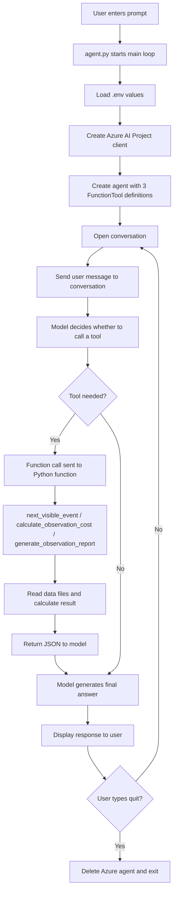

# Astronomy Observation Assistant

This project is a small Azure AI Projects demo that creates an astronomy assistant capable of using custom function tools to answer user questions about upcoming celestial events, telescope booking costs, and observation report generation.

The app combines:

- Azure AI Projects and Azure Identity
- An AI agent created from a model deployment
- Three custom function tools exposed to the agent
- Local Python logic that performs the actual work behind those tools
- A small data store for astronomy events and telescope pricing rules

---

## Project purpose

The assistant helps users with tasks like:

- "What is the next visible astronomical event in north_america?"
- "How much would a premium telescope cost for 4 hours at high priority?"
- "Generate an observation report for the Perseids meteor shower in Europe."

Instead of hardcoding everything in the model prompt, this project shows how to give the model real tool-based capabilities through function calling.

---

## Project structure

```text
Python/
├── agent.py                  # Creates the Azure AI agent and handles chat flow
├── functions.py              # Tool implementations for event lookup, pricing, and report generation
├── requirements.txt          # Python dependencies
├── .env                      # Environment configuration for Azure AI endpoint and model name
├── data/
│   ├── events.txt            # Astronomical events and visible locations
│   ├── telescope_rates.txt   # Hourly telescope rates by tier
│   └── priority_multipliers.txt
└── README.md                 # Project documentation
```

---

## Tools used in this project

This project exposes three tools to the agent.

### 1. next_visible_event

Purpose:
- Finds the next upcoming astronomy event visible from a selected region.

Inputs:
- `location`

Behavior:
- Reads the event list from `data/events.txt`
- Matches the requested location
- Returns the closest upcoming event in JSON format

### 2. calculate_observation_cost

Purpose:
- Calculates the cost of telescope use based on:
  - telescope tier
  - hours requested
  - priority level

Inputs:
- `telescope_tier`
- `hours`
- `priority`

Behavior:
- Reads hourly rates from `data/telescope_rates.txt`
- Reads priority multipliers from `data/priority_multipliers.txt`
- Computes a base cost and total cost
- Returns the result as JSON

### 3. generate_observation_report

Purpose:
- Generates a text summary report for an observation session.

Inputs:
- `event_name`
- `location`
- `telescope_tier`
- `hours`
- `priority`
- `observer_name`

Behavior:
- Calls `calculate_observation_cost`
- Calls `next_visible_event`
- Creates a report text file with session summary information
- Returns JSON with the output file name

---

## Code flow overview



---

## Detailed code flow

### 1. Agent setup in `agent.py`

The `main()` function does the following:

- clears the terminal
- loads environment variables from `.env`
- creates an Azure AI Project client using `DefaultAzureCredential()`
- gets an OpenAI client from the project
- creates three `FunctionTool` objects
- registers them with a `PromptAgentDefinition`
- creates an actual agent using `project_client.agents.create_version()`

The tool definitions are registered with metadata such as:

- `name`
- `description`
- `parameters`
- `required` arguments
- `strict=True`

This tells the model how to call each tool properly.

### 2. Function calling loop

Inside the chat loop:

- the user enters a prompt
- the message is added to the conversation
- the model responds with either a normal answer or a function call
- when the model emits a `function_call`, the app checks the tool name
- it executes the matching Python function from `functions.py`
- it captures the JSON result and sends it back as a `FunctionCallOutput`
- the model then generates the final textual answer

### 3. Function logic in `functions.py`

The functions file is the real implementation layer. It contains:

- `_load_events()`
- `_load_rates()`
- `next_visible_event()`
- `calculate_observation_cost()`
- `generate_observation_report()`

These functions read the local data files and return JSON-formatted strings, which are then used by the agent.

---

## Data files and how they are used

### `data/events.txt`

Example format:

```text
Quadrantids Meteor Shower|meteor_shower|01-03|north_america;europe;asia
```

Each line contains:

- event name
- type
- month-day
- list of visible regions

The code parses these values into a structured list of events and sorts them by date.

### `data/telescope_rates.txt`

Example format:

```text
standard|50.00
advanced|120.00
premium|300.00
```

This file stores the hourly cost for each telescope tier.

### `data/priority_multipliers.txt`

Example format:

```text
low|1.00
normal|1.25
high|1.75
urgent|2.50
```

This file stores the price multiplier for each priority level.

---

## Example execution flow

### Example 1: Event lookup

User:

```text
What is the next visible event in south_america?
```

Flow:

1. Agent receives prompt
2. Model identifies that `next_visible_event` is needed
3. `functions.next_visible_event("south_america")` runs
4. The function checks `events.txt`
5. It returns the next future event in JSON
6. The model explains the result to the user

### Example 2: Cost calculation

User:

```text
How much would premium cost for 3 hours with high priority?
```

Flow:

1. Model calls `calculate_observation_cost`
2. `functions.py` looks up `premium` and `high`
3. It calculates:
   - base cost = hourly rate × hours
   - total cost = base cost × priority multiplier
4. Result is sent back to the model
5. Model responds with the final price

### Example 3: Report generation

User:

```text
Generate a report for the Perseids meteor shower in europe using premium telescope, 5 hours, urgent priority, and observer Alex.
```

Flow:

1. Model calls `generate_observation_report`
2. Function calculates observation cost
3. Function gets next visible event data for the region
4. File is saved locally with a timestamped filename
5. Final response includes the generated report file name

---

## Important Azure AI / OpenAI concepts in this project

### Function tools

Function tools make the model more than just a text generator. They let it:

- choose an external capability
- decide which arguments to provide
- call code in a controlled way
- use structured results in the answer

This is one of the key patterns for practical agentic applications.

### PromptAgentDefinition

`PromptAgentDefinition` is used to define the agent’s behavior, including:

- the model to use
- the system instructions
- the available tools

This allows the agent to act as an astronomy assistant while executing real-world functions.

### Conversation model pattern

The code uses:

- conversation creation
- message submission
- model response handling
- function call output loop

This pattern is typical of agent workflows that require tool use and iterative responses.

---

## Setup

1. Open the project folder
2. Create or update your `.env` file with values like:

```env
PROJECT_ENDPOINT="https://<your-project-endpoint>.services.ai.azure.com/api/projects/<your-project-name>"
MODEL_DEPLOYMENT_NAME="<your-model-deployment-name>"
```

3. Install dependencies:

```bash
pip install -r requirements.txt
```

4. Run the app:

```bash
python agent.py
```

---

## Example prompts to try

```text
What is the next visible event in europe?

How much would an advanced telescope cost for 2.5 hours with normal priority?

Generate a report for Jupiter-Venus Conjunction in australia using standard telescope for 3 hours and low priority.
```

---

## Summary

This project demonstrates a practical AI agent pattern:

- agent receives natural-language requests
- model decides which tool is appropriate
- tool executes real logic
- returned data is incorporated into the final answer
- the user gets a helpful, grounded response based on code, not just generated text

The result is an example of a tool-using agent that can work with real-world data and produce structured outputs in a simple, understandable workflow.
