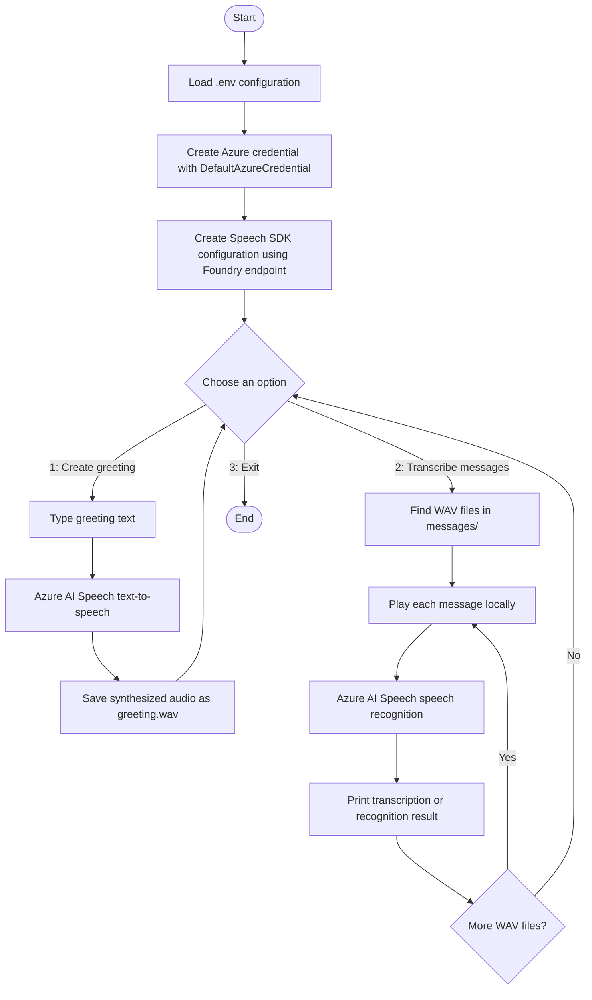

# Azure AI Speech Voice Mail

A small Python command-line application that demonstrates two Azure AI Speech capabilities in a voicemail-style workflow:

- **Text to speech:** turn a greeting typed at the console into a spoken WAV file.
- **Speech to text:** play each supplied voicemail WAV file and print the recognized words.

The app is an educational sample for the Azure AI Speech exercise. It does not record audio from a microphone or connect to a telephone system.

## How It Works



### Runtime sequence

1. The application loads settings from `.env` and creates an Azure credential using `DefaultAzureCredential`.
2. The Azure AI Speech SDK uses the configured Foundry resource endpoint and that credential to make Speech requests.
3. Option **1** asks for greeting text, synthesizes it with the `en-US-Serena:DragonHDLatestNeural` voice, and writes `greeting.wav` in this folder.
4. Option **2** scans `messages/` for `.wav` files. Each file is played on the local machine, then sent to the Speech recognizer for a one-shot transcription. The result is printed to the terminal.
5. Option **3** exits the menu.

## Azure Services and Tools

| Component | Purpose in this project |
| --- | --- |
| **Azure AI Speech** | Provides neural text-to-speech synthesis and speech recognition. |
| **Azure AI Foundry resource endpoint** | Endpoint used by the Speech SDK to access the configured Azure AI resource. |
| **Microsoft Entra ID** | Supplies the signed-in identity used to authenticate Speech SDK requests. The identity must have access to the Azure resource. |
| **Azure CLI** | Used for interactive sign-in with `az login`; `DefaultAzureCredential` can use the Azure CLI credential during local development. |
| **Python Azure Speech SDK** | Creates the speech configuration, synthesizer, audio output, and recognizer. |
| **Python `playsound3`** | Plays each input message locally before transcription. |
| **Python `python-dotenv`** | Loads the local `.env` settings into environment variables. |

## Project Files

- `voice-mail.py` - menu, Azure authentication, text-to-speech, and transcription logic.
- `requirements.txt` - Python packages used by the sample.
- `.env` - local configuration, including the Foundry endpoint.
- `messages/` - sample voicemail recordings (`.wav`) processed by option 2.
- `greeting.wav` - generated output from option 1; created when the greeting is synthesized.

## Prerequisites

- Python 3.10 or later recommended for the lab environment.
- An Azure AI Foundry resource with Azure AI Speech available.
- Azure CLI installed and an account signed in with permission to use the resource.
- Working audio output if you want to listen to message files.

## Configure and Run

Run these commands from this project folder. On Windows PowerShell:

```powershell
python -m venv .venv
.venv\Scripts\Activate.ps1
pip install -r requirements.txt
az login
python voice-mail.py
```

On macOS or Linux, activate the environment with:

```bash
source .venv/bin/activate
```

Set the endpoint in `.env` to the endpoint for your Azure AI Foundry resource. The lab uses this endpoint format:

```dotenv
FOUNDRY_ENDPOINT=https://<your-resource-name>.cognitiveservices.azure.com/
```

The application currently authenticates with Microsoft Entra ID through `DefaultAzureCredential`. Sign in with `az login` and ensure the signed-in identity has the required access to the Azure AI resource. `FOUNDRY_KEY` may also be present in the provided `.env`, but the current Python code does not read or use it.

When the menu appears, enter:

- `1` to type and synthesize a greeting into `greeting.wav`.
- `2` to listen to and transcribe the WAV files in `messages/`.
- `3` to exit.

## Implementation Notes

- The menu and Azure configuration are initialized in `main()`.
- `record_greeting()` passes the entered text to the Speech SDK synthesizer and writes the synthesized audio to a file.
- `transcribe_messages()` enumerates local WAV files, plays each one with `playsound3`, and submits it to `SpeechRecognizer` using `recognize_once_async()`.
- `recognize_once_async()` is a one-shot recognition operation, suitable for short utterances; it is not continuous transcription of long recordings.
- The sample handles success and non-success Speech SDK results by checking the result reason. Azure access, configuration, audio playback, and network errors may also need to be addressed in the local environment.

## Dependencies

Install the project dependencies with `pip install -r requirements.txt`:

- `azure-cognitiveservices-speech==1.48.2`
- `azure-identity`
- `python-dotenv`
- `playsound3`

## Learn More

- [Azure AI Speech documentation](https://learn.microsoft.com/azure/ai-services/speech-service/)
- [Speech to text](https://learn.microsoft.com/azure/ai-services/speech-service/index-speech-to-text)
- [Text to speech](https://learn.microsoft.com/azure/ai-services/speech-service/index-text-to-speech)
- [Sign in to Azure with the Azure CLI](https://learn.microsoft.com/cli/azure/authenticate-azure-cli-interactively)
