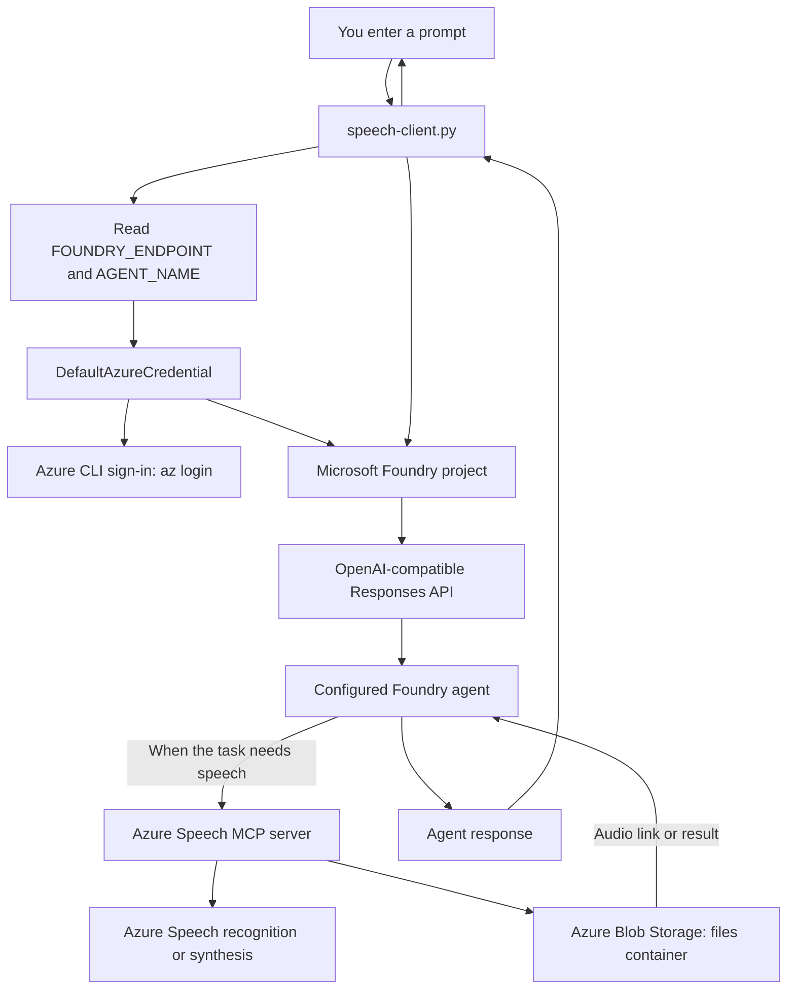

# Azure Speech Agent Console Client

A small Python command-line client for chatting with a Microsoft Foundry agent that can use Azure Speech tools. Ask the agent to synthesize text as speech or transcribe an audio file; the agent can call the Azure Speech MCP server connected to the Foundry project.

The Python program is the chat client, not the speech engine. It sends your text prompt to the configured agent and displays the agent's response. Speech processing and generated-audio storage are handled by the connected Azure services.

## How It Works



## Azure Services and Tools

| Component | Role in this project |
| --- | --- |
| **Microsoft Foundry project** | Hosts the project endpoint and the configured `speech-agent`. The client uses the project SDK to obtain an OpenAI-compatible client. |
| **Foundry agent** | Interprets the user's request and decides when to use its connected speech tool. The exercise configures an agent named `speech-agent`. |
| **Azure Speech in Foundry Tools MCP server** | Gives the agent speech recognition and speech synthesis capabilities through a remote MCP connection. Configure this connection in Foundry and attach it to the agent. |
| **Azure Blob Storage** | Stores generated audio. The exercise uses a container named `files`; its SAS URL is configured on the MCP connection. |
| **Azure CLI and Microsoft Entra ID** | `DefaultAzureCredential` can use the signed-in Azure CLI identity to authenticate the client to Foundry. |
| **Python packages** | `azure-ai-projects` provides the project client, `azure-identity` provides credentials, `openai` provides the Responses API client, and `python-dotenv` loads local settings. `httpx` is also installed as a dependency. |

## Request Flow

1. The client loads `FOUNDRY_ENDPOINT` and `AGENT_NAME` from `.env`.
2. `DefaultAzureCredential` obtains an Azure identity. In the lab's local workflow, sign in first with `az login`.
3. `AIProjectClient` connects to the Foundry project and creates an OpenAI-compatible client.
4. For each prompt, the program calls `openai_client.responses.create`, passing the agent reference in `extra_body`.
5. The agent responds directly, or calls its configured Azure Speech MCP tool when speech work is needed.
6. The client prints `response.output_text`. For generated audio, the agent's response can include a link to the file in Blob Storage.

## Prerequisites

- An Azure subscription with access to a Microsoft Foundry project.
- Python **3.13** (the exercise was tested with Python 3.13.12).
- Azure CLI installed and available as `az`.
- A Foundry agent configured with the Azure Speech MCP server. Follow the [exercise instructions](../../../../Instructions/Exercises/05-azure-speech-mcp.md) to create and connect the project, agent, MCP tool, and storage container.

## Configure and Run

Open a terminal in this folder, create and activate a virtual environment, then install the dependencies:

```powershell
python -m venv .venv
.\.venv\Scripts\Activate.ps1
pip install -r requirements.txt
```

Create or update `.env` with your Foundry project endpoint and the exact, case-sensitive agent name:

```dotenv
FOUNDRY_ENDPOINT=https://<your-foundry-project-endpoint>
AGENT_NAME=speech-agent
```

Sign in with the Azure identity that has access to the Foundry project, then start the client:

```powershell
az login
python speech-client.py
```

Enter a prompt and press Enter. Type `quit` or submit an empty prompt to exit. Example requests include asking the agent to generate a spoken sentence or transcribe an audio file URL.

## Implementation Notes

- `load_dotenv()` loads local configuration without embedding the endpoint or agent name in the source code.
- `AIProjectClient` is initialized with the project endpoint and `DefaultAzureCredential`; no API key is hard-coded in the client.
- `project_client.get_openai_client()` supplies the client used to call the agent through the Responses API.
- The `agent_reference` in each request routes the prompt to the configured Foundry agent. The Python program does not implement audio recording, transcription, or synthesis itself.
- The current program is an interactive text console. Audio interaction and the MCP tool connection are configured in Microsoft Foundry.

## Security Notes

- Keep `.env` and SAS URLs private. Do not commit credentials, SAS tokens, or other secrets to source control.
- Use a short-lived, least-privilege SAS token for the storage container and rotate it when it expires or is exposed.
- Grant the signed-in identity only the Azure access needed for the Foundry project.

## Troubleshooting

- **Authentication fails:** run `az login`, select the subscription containing the Foundry resource, and verify your identity has access to the project.
- **Agent or endpoint errors:** check the spelling and value of `FOUNDRY_ENDPOINT` and `AGENT_NAME`; the agent name is case-sensitive.
- **Speech requests do not use the tool:** confirm the Azure Speech MCP server connection is healthy and attached to the agent in Foundry.
- **Generated audio cannot be accessed:** confirm the MCP connection's Blob container URL and SAS token are valid, and that the `files` container exists.
- **A transcription is blocked or a tool call fails temporarily:** follow the retry and alternate sample-audio guidance in the exercise instructions.
