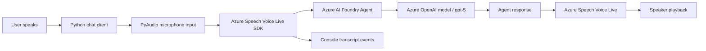

# Azure Voice Live Chat Client

## Project name and purpose

This folder contains a Python-based voice assistant client for Microsoft Foundry and Azure Speech Voice Live.

The project is designed to let a user speak to an AI agent in real time, while the client:

- captures microphone audio,
- sends it to a Foundry agent,
- receives responses from the agent,
- plays the spoken response back through the system speaker.

This sample is part of the Microsoft Learn lab for Azure AI Foundry Voice Live and is used to demonstrate real-time conversational AI with speech input and output.

## What this project does

The app connects to a Voice Live agent configured in Azure AI Foundry, then starts a live session where:

1. the microphone records user speech,
2. the Voice Live SDK sends audio to the agent,
3. Azure Speech and the agent model process the request,
4. the spoken response is streamed back as audio,
5. the client prints transcripts to the console for visibility.

## Tools and Azure services used

### Tools

- Python 3.13+
- Visual Studio Code
- Azure CLI (`az login`)
- PyAudio for microphone and speaker access
- Azure Identity library for secure authentication

### Azure services

- Microsoft Foundry / Azure AI Foundry Project
  - organizes the agent, model, and resources
- Azure Speech Voice Live
  - handles real-time speech input and output
- Azure OpenAI / Foundry model deployment (for example, gpt-5)
  - performs the reasoning and response generation
- Azure AI Services endpoint
  - provides the secure connection target for the client
- Azure CLI authentication with `AzureCliCredential`
  - signs in without hardcoding secrets

## Architecture flow



## Solution flow in plain language

```text
User input (voice)
    ↓
Python app in this folder
    ↓
Voice Live connection to Foundry agent
    ↓
Agent processes spoken request using the deployed model
    ↓
Response is generated and converted to speech
    ↓
Audio is played back to the user
```

## Project files

- `chat-client.py` – main client application that establishes the voice session and audio flow
- `requirements.txt` – required Python packages
- `.env` – local environment settings for endpoint, project name, and agent ID

## Required configuration

Set the following values in the `.env` file before running the client:

```env
AZURE_VOICELIVE_ENDPOINT=https://<your-foundry-resource-name>.services.ai.azure.com
AZURE_VOICELIVE_PROJECT_NAME=<your-foundry-project-name>
AZURE_VOICELIVE_AGENT_ID=<your-agent-name>
```

Important notes:

- The endpoint should be the Azure AI Foundry resource base URL, not the full project API URL.
- The agent name is case-sensitive and should match the agent created in Foundry.
- You must be signed in to Azure with the Azure CLI before running the app.

## Setup steps

1. Open a terminal in this folder.
2. Create and activate a Python virtual environment if needed.
3. Install dependencies:

```bash
pip install -r requirements.txt
```

4. Sign in to Azure:

```bash
az login
```

5. Update the `.env` file with your Foundry project values.
6. Run the app:

```bash
python chat-client.py
```

## Notes

- This app is a client sample and depends on an Azure AI Foundry project that has a configured agent and Voice Live enabled.
- The project uses the Azure CLI identity to authenticate, which is ideal for local development.
- The app is designed for interactive, real-time voice conversations rather than batch processing.

## Summary

This folder represents a complete real-time speech AI client built around Azure Speech Voice Live and Microsoft Foundry. It shows how a local Python application can connect to a hosted agent, stream audio, and turn spoken input into a conversational experience using Azure-native AI services.
