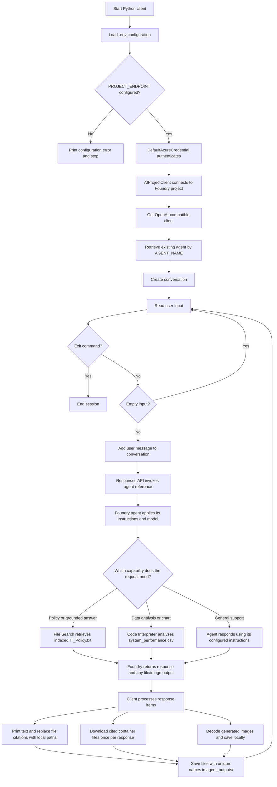

# IT Support Agent with Microsoft Foundry

This project is a command-line client for an IT support agent created in Microsoft Foundry. Ask questions about company IT policies, request analysis of system performance data, or ask the agent to create a chart. The agent's instructions, model, and built-in tools are configured in the Foundry portal; the Python application connects to that existing agent and handles the conversation and generated files.

## What it can do

- Answer IT policy questions using Foundry File Search grounded in `IT_Policy.txt`.
- Analyze the sample `system_performance.csv` and create visualizations with the Foundry Code Interpreter when requested.
- Keep a conversation open for the duration of the client session.
- Print agent responses, download cited/generated files, decode generated images, and save those outputs under `agent_outputs/` without overwriting earlier files.

The CSV contains simulated CPU, memory, and disk usage measurements. The policy file and performance data must be attached to the agent in Foundry as described in the [exercise guide](Instructions/Exercises/01-build-agent-portal-and-vscode.md). The client does not upload or configure those tools at runtime.

## Architecture and request flow



File Search and Code Interpreter are tools on the Foundry agent, not Python functions registered by `agent_with_functions.py`. The agent selects the appropriate capability for each request. The client recognizes text, container-file citations, and image outputs; it downloads cited files through the Foundry OpenAI-compatible client and saves returned image data locally.

## Microsoft and Python components

| Component | Purpose |
| --- | --- |
| Microsoft Foundry project and portal | Host the project and the `it-support-agent` prompt agent, its instructions, and selected model. |
| Foundry File Search | Ground policy answers in the uploaded and indexed `IT_Policy.txt`. |
| Foundry Code Interpreter | Analyze the attached performance CSV and generate charts or other files. |
| Foundry Toolkit for Visual Studio Code | Sign in, select the project, inspect the agent, and copy the project endpoint. |
| Azure AI Projects Python SDK (`azure-ai-projects`) | Create an `AIProjectClient`, retrieve the configured agent, and obtain its OpenAI-compatible client. |
| Azure Identity (`azure-identity`) | Authenticate with `DefaultAzureCredential`; sign in with an Azure credential available to the local development environment. |
| Conversations and Responses APIs | Maintain the session conversation and send each turn to the Foundry agent reference. |
| `python-dotenv` and OpenAI Python SDK | Load local settings and provide the compatible API types/client surface. The requirements pin OpenAI to `<3` for SDK compatibility. |

The application also uses Python's `base64`, `os`, and `pathlib` standard-library modules for configuration, image decoding, and file management.

## Prerequisites

- A Microsoft Foundry project with a deployed model and an agent named `it-support-agent` (or the name you configure below).
- The agent configured with suitable instructions, File Search, and Code Interpreter. Attach `IT_Policy.txt` to File Search and `system_performance.csv` to Code Interpreter.
- Access to the Foundry project for the signed-in identity, plus any required Azure subscription permissions and model quota.
- Python 3.13, Visual Studio Code, and the Foundry Toolkit extension. This exercise was tested with Python 3.13; its dependencies may not support newer Python releases yet.

## Run locally

Open a terminal in `Labfiles/01-build-agent-portal-and-vscode/Python` and create an environment:

```powershell
py -3.13 -m venv .venv
.\.venv\Scripts\Activate.ps1
python -m pip install -r requirements.txt
Copy-Item .env.example .env
```

In `.env`, set the endpoint copied from your Foundry project. The agent name is optional and defaults to `it-support-agent`:

```dotenv
PROJECT_ENDPOINT=https://<your-foundry-resource>.services.ai.azure.com/api/projects/<your-project>
AGENT_NAME=it-support-agent
```

Sign in with an identity that can access the project (for example, run `az login` if using Azure CLI credentials), then start the client from the same Python directory:

```powershell
python agent_with_functions.py
```

Ask a question at the `You:` prompt. Enter `exit`, `quit`, or `bye` to end the session. Empty input is ignored.

Example prompts:

```text
What's the policy for password resets?
Can you analyze the system performance data and tell me if there are any concerning trends?
Create a chart showing CPU usage over time from the performance data.
```

## Output files

The client creates `agent_outputs/` in its current working directory when it saves a file. It downloads cited container files, stores returned images as `chart_1.png`, `chart_2.png`, and so on for each response, and adds a numeric suffix when a filename already exists. Text citations are rewritten to show the corresponding local path.

## Project files

- `Labfiles/01-build-agent-portal-and-vscode/Python/agent_with_functions.py` - command-line client and response/file handling.
- `Labfiles/01-build-agent-portal-and-vscode/Python/requirements.txt` - Python dependencies.
- `Labfiles/01-build-agent-portal-and-vscode/Python/.env.example` - project endpoint and agent name template.
- `Labfiles/01-build-agent-portal-and-vscode/IT_Policy.txt` - policy grounding document to attach to the agent.
- `Labfiles/01-build-agent-portal-and-vscode/system_performance.csv` - sample data for Code Interpreter analysis.
- `Instructions/Exercises/01-build-agent-portal-and-vscode.md` - end-to-end Foundry setup and exercise steps.

Keep `.env` private. It contains environment-specific project configuration and should not be committed.

