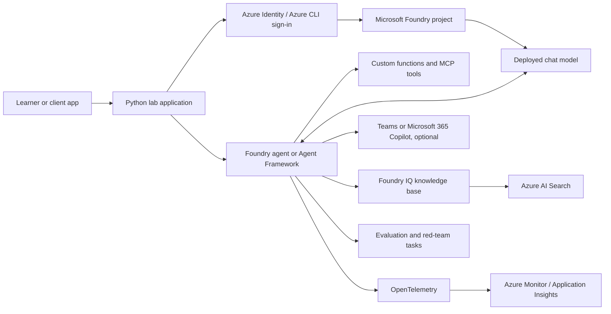
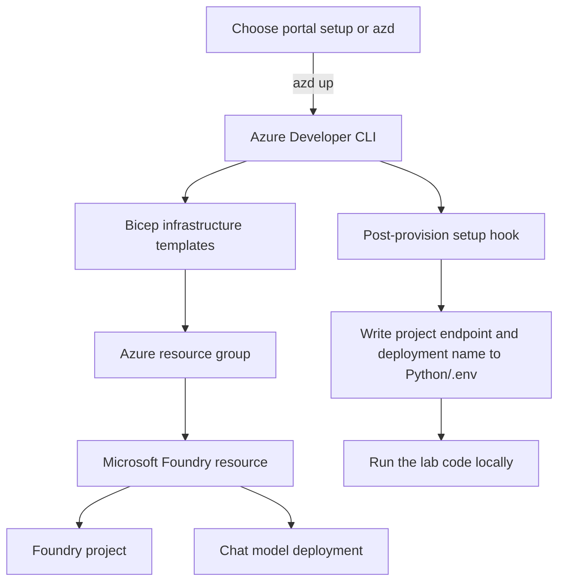

# Develop AI Agents in Azure

This repository contains hands-on exercises for building, connecting, observing, evaluating, and securing AI agents with Microsoft Azure. The labs use a fictional company, Caldova, to give the exercises a consistent business scenario.

Start with the [workshop exercises](https://go.microsoft.com/fwlink/?linkid=2310820) or choose a lab below. The exercises complement the [Microsoft Learn AI agents learning path](https://learn.microsoft.com/training/paths/develop-ai-agents-azure/).

> **Azure costs and access:** Running the cloud exercises requires an Azure subscription with permission and model quota for the resources you use. Some optional Microsoft 365 exercises also require tenant admin consent or a Microsoft 365 Copilot license. Delete lab resources when you finish.

## What You Will Build

The main workshop is organized as four modular learning tracks. Each track has a getting-started page and task pages; complete the core tasks first, then choose optional tasks that fit your goals.

| Track | What you practice | Start here |
| --- | --- | --- |
| A. Build and extend agents | Ground an agent in company policy; add remote MCP and custom function tools; call it from a client; optionally host it. | [Track A](Instructions/Consolidated/A-build-and-extend-ai-agents.md); [Setup](Instructions/Consolidated/A0-getting-started.md) |
| B. Enterprise knowledge and Microsoft 365 | Ground an agent with Foundry IQ; connect from code; optionally publish to Teams or Microsoft 365 Copilot, and explore Work IQ. | [Track B](Instructions/Consolidated/B-integrate-agents-with-enterprise-knowledge-and-m365.md); [Setup](Instructions/Consolidated/B0-getting-started.md) |
| C. Multi-agent solutions | Build a tool-using agent; orchestrate agents in sequence; connect remote agents with A2A; classify and route tickets. | [Track C](Instructions/Consolidated/C-build-multi-agent-solutions-with-agent-framework.md); [Setup](Instructions/Consolidated/C0-getting-started.md) |
| D. Observe, evaluate, and secure | Trace agent runs; evaluate answer quality; optionally run adversarial red-team tests. | [Track D](Instructions/Consolidated/D-observe-evaluate-and-secure-agents.md); [Setup](Instructions/Consolidated/D0-getting-started.md) |

There is also a standalone [Agent Framework expense-claim example](Labfiles/07-agent-framework/python/agent-framework.py). Its sample tool prints a proposed email; it does not send a real email.

## How It Fits Together

The local Python code connects to a Microsoft Foundry project and deployed chat model. Depending on the task, the agent can retrieve enterprise knowledge, call local or remote tools, collaborate with other agents, or emit telemetry for evaluation and monitoring.



Not every lab uses every component. Foundry IQ, Azure AI Search, Teams, Microsoft 365 Copilot, Work IQ, monitoring, and evaluation are introduced in the relevant tasks rather than being provisioned by every setup path.

### Optional Azure Provisioning Flow

Each consolidated lab includes an optional Azure Developer CLI (`azd`) setup. The default instructions also explain how to create the Foundry project in the portal.



The shared `azd`/Bicep template provisions the Foundry resource, project, and chat model deployment. It does not deploy the local lab application, and it does not create every optional integration. For example, Track D requires Application Insights to be connected separately.

## Tools and Technologies

| Tool or technology | How the project uses it |
| --- | --- |
| Python | Lab applications, setup scripts, and repository content checks. Each lab has its own `requirements.txt`; there is no single root Python environment for all labs. |
| Microsoft Foundry SDKs | Connect Python apps to Foundry projects, agents, and model deployments. The lab dependencies include `azure-ai-projects` and related agent packages. |
| Microsoft Agent Framework | Define agents and tools, run tool-calling loops, and build multi-agent orchestrations. |
| Azure Identity | Authenticate local code with Azure credentials, commonly through Azure CLI sign-in. |
| MCP and FastMCP | Expose and call tools through the Model Context Protocol, locally or remotely. |
| A2A SDK | Connect remote agents using the Agent-to-Agent protocol in the multi-agent track. |
| Gradio, FastAPI, and Uvicorn | Provide sample chat interfaces and local HTTP services in selected exercises. |
| OpenTelemetry | Create and export agent traces in the observability track. |
| Azure AI Evaluation and PyRIT | Score answer quality and run optional adversarial red-team tests. PyRIT is used by the red-team exercise. |
| Azure Developer CLI (`azd`) and Bicep | Optionally provision the common Foundry resources from infrastructure-as-code templates. |
| Jekyll and GitHub Pages | Build and publish the learning pages. Markdown pages use front matter; selected website-only pages use Liquid templates. |
| Repository check scripts | Validate links, front matter, code examples, generated lab sections, SDK imports, and synchronized shared infrastructure. |

## Azure and Microsoft Services

| Service | Role in the exercises | Where it appears |
| --- | --- | --- |
| Microsoft Foundry (Azure AI Services) | Hosts the project, model deployment, and agent experiences used by the Python exercises. | Common foundation for Tracks A-D. |
| Azure OpenAI model deployments in Foundry | Provide chat completions and agent reasoning. Availability, model choice, quota, and region depend on the subscription. | Common foundation for code labs. |
| Azure AI Search | Provides the searchable index behind enterprise knowledge scenarios. | Track B, through Foundry IQ. |
| Foundry IQ | Connects agents to knowledge bases and supports retrieval over organization documents. | Track B. |
| Azure Monitor and Application Insights | Receive OpenTelemetry traces and show agent execution details. The Application Insights resource must be connected for the tracing task. | Track D; some hosted-agent deployment scenarios also use it. |
| Azure resource groups | Group lab resources so they can be managed and cleaned up together. | Portal and `azd` setup paths. |
| Microsoft Teams and Microsoft 365 Copilot | Optional surfaces for publishing an agent to end users. These require suitable Microsoft 365 tenant access and permissions. | Track B; not part of the common Bicep deployment. |
| Work IQ | Optional MCP-based access to permission-aware Microsoft 365 workplace signals such as mail, meetings, and Teams messages. | Track B; requires additional setup and consent. |

Azure AI Search and Application Insights are not created by the shared `azd` template. Follow the individual task's prerequisites and setup instructions; resource requirements can vary by task.

## Step-by-Step: Run a Lab

1. **Choose a track.** Open one of the Track A-D pages above and read its **Getting started** page before opening a task. Tasks marked optional may need extra services, licenses, or permissions.
2. **Check prerequisites.** Have Git, Visual Studio Code, Python, and an Azure subscription available. Python 3.13 is the version tested by the current lab setup pages; check the selected track's instructions for the current supported version and any extra prerequisites.
3. **Create the Foundry project and model deployment.** Use the Azure portal as described in the setup page, or use the optional `azd` path from that lab's folder:

   ```powershell
   azd auth login
   azd up
   ```

   `azd up` provisions the infrastructure and runs a setup hook that writes the project endpoint and model deployment name into the lab's `.env` file.
4. **Open the lab's Python folder.** For example, Track A is under `Labfiles/A-build-and-extend-ai-agents/Python`. Each track keeps its own starter code, dependency list, virtual environment, and environment configuration.
5. **Create and activate a virtual environment, then install that lab's dependencies.** In PowerShell, from the selected `Python` folder:

   ```powershell
   python -m venv labenv
   .\labenv\Scripts\Activate.ps1
   pip install -r requirements.txt
   ```

6. **Configure `.env`.** Set `PROJECT_ENDPOINT` and `MODEL_DEPLOYMENT_NAME` as described in the setup page. Some tasks need additional values. Do not commit credentials or secrets.
7. **Run the task's preflight and follow its steps.** The setup scripts and command-line options vary between tracks. Use the task page's exact command, then run the sample application or script it identifies.
8. **Review the result.** Depending on the task, this may be an agent response, a tool result, an MCP call, a multi-agent workflow, a trace, or an evaluation report.
9. **Clean up Azure resources.** If you provisioned with `azd`, run `azd down` from the same lab folder when finished. If you created resources manually, delete the lab resource group in the Azure portal. Separately created integrations may need separate cleanup.

## Repository Layout

```text
Instructions/Consolidated/   Lab overview, setup, and task instructions
Instructions/Exercises/      Exercise-oriented versions of selected material
Labfiles/                    Python starter code, solutions, setup, and Bicep templates
Labfiles/_shared/            Canonical shared azd/Bicep files and sync utility
tools/                       Lab content generation and validation scripts
_layouts/                    Jekyll layouts for the workshop site
index.md                     Website home page and exercise index
workshop.md                  Instructor-led workshop agenda
labs.json                    Generated machine-readable lab catalogue
readme.md                    Repository and local setup guide
```

Starter code is under `Labfiles/<lab-folder>/Python/`; reference solutions are under the corresponding `Solution/Python/` folder when provided. The lab instruction pages are the source of truth for exact task commands and prerequisites.

## Step-by-Step: Validate Content Changes

The content checks run locally without Azure credentials or Azure resources. Install their dependencies once, then run the checks from the repository root:

```powershell
pip install -r tools/checks/requirements.txt
python tools/checks/check_frontmatter.py
python tools/checks/check_code_blocks.py
python tools/checks/check_links.py
python tools/checks/check_line_endings.py
python tools/generate_lab_blocks.py --check
python Labfiles/_shared/sync.py --check
```

The checks catch malformed page metadata, invalid Python code blocks, broken local links, line-ending drift, out-of-date generated task tables, and drift in copies of shared provisioning files. The SDK contract check installs lab dependencies and runs separately in CI; see [the check documentation](tools/checks/README.md).

## Reporting Issues

If an exercise does not work as described, please [open an issue](https://github.com/MicrosoftLearning/mslearn-ai-agents/issues) with the lab/task name, the command you ran, and the error message. Remove secrets, access tokens, and personal data before sharing logs.

