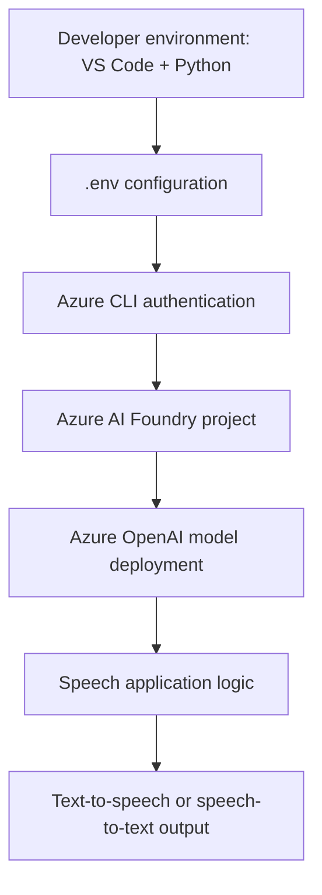

```mermaid
flowchart LR
    A[User writes text prompt] --> B[Python app loads .env]
    B --> C[Authenticate with Azure]
    C --> D[AzureOpenAI client created]
    D --> E[Deploy model: gpt-4o-mini-tts]
    E --> F[Send speech generation request]
    F --> G[Audio response generated]
    G --> H[Save to speech.mp3]
    H --> I[Play audio with playsound]
```

```mermaid
flowchart LR
    A[Audio file is created or available] --> B[Python app loads .env]
    B --> C[Authenticate with Azure]
    C --> D[AzureOpenAI client created]
    D --> E[Deploy model: gpt-4o-mini-transcribe]
    E --> F[Send audio file for transcription]
    F --> G[Speech-to-text model analyzes audio]
    G --> H[Return transcription text]
    H --> I[Display result in terminal]
```

# Speech-Enabled Generative AI Projects

This folder contains two Python projects that demonstrate how generative AI can be used for speech scenarios in Azure:

- `generate-speech` — converts text into spoken audio
- `transcribe-speech` — converts audio into text

Both projects use Azure AI Foundry and Azure OpenAI models to process speech through the OpenAI Python SDK.

---

## Overview

The lab focuses on two common speech capabilities:

1. Speech synthesis (text-to-speech)
2. Speech recognition (speech-to-text)

These scenarios are implemented using Azure-hosted generative AI models that can be accessed from Python applications with authentication and inference APIs.

---

## Project 1: Generate Speech

### Purpose

The `generate-speech` project sends a text prompt to a deployed speech model and generates an audio file that can be played back.

### Files

- `generate-speech.py` — Python script that creates the Azure OpenAI client, sends the text prompt, and saves the generated audio output.
- `requirements.txt` — dependencies needed to run the project.
- `.env` — stores the Azure OpenAI endpoint and model deployment name.

### Tools used

- Python 3.x
- Visual Studio Code
- Azure CLI (`az login`)
- OpenAI Python SDK (`openai`)
- `azure-identity` for managed authentication
- `python-dotenv` for loading environment values
- `playsound3` for playing the generated audio file

### Azure services used

- Azure AI Foundry project
- Azure OpenAI deployed model such as `gpt-4o-mini-tts`
- Azure identity via `DefaultAzureCredential` and `get_bearer_token_provider`

### How it works

The app:

1. Loads configuration values from `.env`
2. Authenticates to Azure using `DefaultAzureCredential`
3. Builds an `AzureOpenAI` client
4. Sends a text prompt to the text-to-speech model
5. Streams the response to a `.mp3` file
6. Plays the audio file locally

### Flowchart



### Example flow in code

The script uses the Azure OpenAI SDK to call the speech model with instructions such as:

```python
with client.audio.speech.with_streaming_response.create(
    model=model_deployment,
    voice="alloy",
    input="My voice is my passport!",
    instructions="Speak in a serious tone.",
) as response:
    response.stream_to_file(speech_file_path)
```

---

## Project 2: Transcribe Speech

### Purpose

The `transcribe-speech` project reads an audio file and converts it into text using a speech-to-text model.

### Files

- `transcribe-speech.py` — Python script that loads the audio file, authenticates, and sends it to the transcription model.
- `requirements.txt` — project dependencies.
- `.env` — contains model endpoint and deployment name.

### Tools used

- Python 3.x
- Visual Studio Code
- Azure CLI (`az login`)
- OpenAI Python SDK (`openai`)
- `azure-identity` for Azure authentication
- `python-dotenv` for configuration loading
- `playsound3` to play the source audio for verification

### Azure services used

- Azure AI Foundry project
- Azure OpenAI deployment such as `gpt-4o-mini-transcribe`
- Azure identity and managed access via `DefaultAzureCredential`

### How it works

The app:

1. Reads the audio file from the project folder
2. Authenticates to Azure
3. Creates an `AzureOpenAI` client
4. Sends the audio file to the transcription model
5. Receives a text transcription
6. Prints the recognized text to the console

### Flowchart



### Example flow in code

```python
audio_file = open(file_path, "rb")
transcription = client.audio.transcriptions.create(
    model=model_deployment,
    file=audio_file,
    response_format="text"
)

print(transcription)
```

---

## Common Architecture

Both projects follow a similar pattern:



---

## Dependencies

The projects use the following packages:

```txt
python-dotenv
playsound3
azure-identity
openai
```

These packages allow the script to:

- load environment variables
- authenticate to Azure securely
- communicate with the Azure OpenAI service
- generate or transcribe speech
- play audio locally

---

## Azure Setup needed

Before running either script, you need:

- An Azure subscription
- An Azure AI Foundry project
- A deployed speech model
  - `gpt-4o-mini-tts` for text-to-speech
  - `gpt-4o-mini-transcribe` for speech-to-text
- The correct endpoint and deployment name stored in `.env`
- Azure login via:

```powershell
az login
```

---

## Summary

These two projects show how Azure AI speech models can be used in real-world applications:

- `generate-speech` transforms text into natural-sounding speech
- `transcribe-speech` converts spoken audio into readable text

Together, they demonstrate the core building blocks of speech-enabled AI experiences using Python, Azure AI Foundry, and Azure OpenAI.
