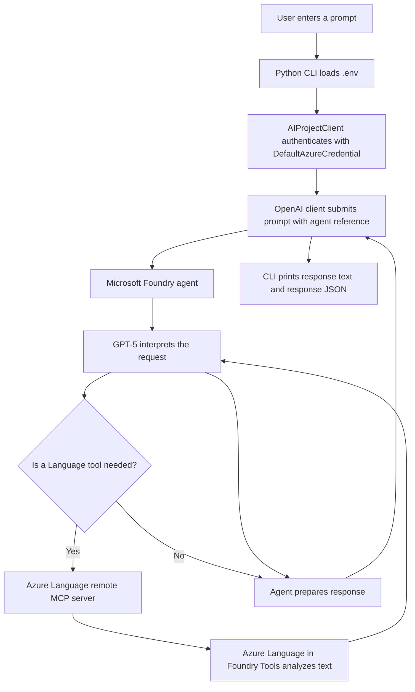

# Text Analysis Agent with Microsoft Foundry

A Python command-line client for a Microsoft Foundry agent configured to analyze text with Azure Language in Foundry Tools. Enter a prompt in the terminal and the client sends it to the named agent, prints its answer, and displays the response details returned by the service.

The Python app does not call Azure Language directly. The Language MCP server and model are configured as tools and a model for the agent in Microsoft Foundry; the agent decides when to use them.

## What It Can Do

With the agent and Language tool configured, prompts can ask it to:

- Extract named entities such as people, places, and dates.
- Detect sentiment in a review or other text.
- Identify and redact personally identifiable information (PII).
- Answer general questions about text analysis based on the agent's instructions.

Available behavior depends on the instructions, model, and tools configured for your agent.

## Azure Services

| Service | How this project uses it |
| --- | --- |
| Microsoft Foundry project and agent | Hosts the agent and provides the project endpoint used by the Python client. |
| GPT-5 model deployment | The model selected for the agent in Foundry; the agent uses it to interpret prompts and compose responses. |
| Azure Language in Foundry Tools | Provides text analysis capabilities to the agent through its remote MCP server, when the agent needs a Language tool. |
| Microsoft Entra ID | Authenticates the client through `DefaultAzureCredential`; Azure CLI sign-in is used in the quick-start steps below. |

## Tools and Libraries

- Python 3.13
- Microsoft Foundry SDK for Python: `azure-ai-projects`
- Azure Identity SDK: `azure-identity`
- OpenAI Python SDK: `openai` (used through the Foundry project client)
- `python-dotenv` for loading local configuration from `.env`
- `httpx`, an HTTP client dependency
- Azure CLI for signing in with `az login`
- Visual Studio Code is the recommended editor for the lab

## Prerequisites

1. An Azure subscription with access to a Microsoft Foundry resource and project.
2. A Foundry agent configured with a GPT-5 deployment.
3. The Azure Language in Foundry Tools MCP connection attached to the agent if you want to use Language analysis.
4. Python 3.13 and Azure CLI installed.
5. An Azure identity with permission to access the Foundry project and agent.

The agent and MCP connection are created in Microsoft Foundry. Follow the repository exercise [Develop a text analysis agent](../../../../Instructions/Exercises/02-language-agent.md) to configure them.

## Configure and Run

Open a terminal in this directory. Create and activate a virtual environment, then install the dependencies:

```powershell
py -3.13 -m venv .venv
.\.venv\Scripts\Activate.ps1
python -m pip install -r requirements.txt
```

For macOS or Linux, use the equivalent activation command:

```bash
python3.13 -m venv .venv
source .venv/bin/activate
python -m pip install -r requirements.txt
```

Set the project endpoint and agent name in the existing `.env` file. Use the full project endpoint shown in the Microsoft Foundry portal, and make sure the agent name matches exactly:

```dotenv
FOUNDRY_ENDPOINT=<your-foundry-project-endpoint>
AGENT_NAME=Text-Analysis-Agent
```

Sign in to Azure so `DefaultAzureCredential` can use your Azure CLI identity, then start the client:

```powershell
az login
python text-agent.py
```

At the `User prompt:` prompt, enter a text-analysis request. For example:

```text
Tell me what entities and dates are mentioned in this review, and whether it is positive or negative: "I booked my flight to Paris in July with Margie's Travel, and it was fantastic!"
```

The client prints the agent's text response and a JSON dump of the response object, which can include details about tools used by the agent.

## Request Flow



## Configuration Reference

| Variable | Description |
| --- | --- |
| `FOUNDRY_ENDPOINT` | The project endpoint copied from the Microsoft Foundry portal. |
| `AGENT_NAME` | The exact name of the agent to invoke, for example `Text-Analysis-Agent`. |

Do not put API keys, tokens, or other secrets in source control. This sample authenticates with `DefaultAzureCredential`; `az login` is the suggested local development sign-in method.
