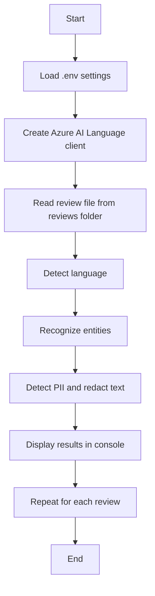

# Text Analysis with Azure AI Language

This project demonstrates how to use Azure AI Language to analyze customer review text for:

- Language detection
- Named entity recognition
- Personally identifiable information (PII) detection and redaction

It processes review text files stored in the `reviews` folder and prints the analysis results in the terminal.

---

## Overview

The application reads text files from the `reviews` directory, sends each file to the Azure AI Language service, and then displays:

- the detected language of the review
- entities mentioned in the text
- any PII found in the content
- a redacted version of the text

This is a practical example of using Azure AI services for document analysis in a Python app.

---

## Tools Used

This project uses the following tools and technologies:

- Python 3.13+
- Visual Studio Code
- Azure CLI
- Git
- `pip` for package installation
- Python virtual environment (`venv`)
- `.env` configuration file for environment variables

### Python Libraries

- `python-dotenv` - loads environment variables from `.env`
- `azure-identity` - authenticates to Azure using `DefaultAzureCredential`
- `azure-ai-textanalytics` - interacts with Azure AI Language Text Analytics APIs

---

## Azure Services Used

### Azure AI Language

This project uses the Azure AI Language service, specifically the Text Analytics capabilities of the Azure AI Foundry platform.

The service performs the following tasks:

- `detect_language()` - identifies the language of the review text
- `recognize_entities()` - extracts people, places, organizations, and other named entities
- `recognize_pii_entities()` - identifies PII such as names, locations, or sensitive values

### Azure AI Foundry Project

The app connects to an Azure AI Foundry project endpoint configured in the environment.

The endpoint is stored in the `.env` file and is used to create a `TextAnalyticsClient`:

```python
from azure.ai.textanalytics import TextAnalyticsClient
from azure.identity import DefaultAzureCredential

credential = DefaultAzureCredential()
ai_client = TextAnalyticsClient(endpoint=foundry_endpoint, credential=credential)
```

### Azure Authentication

Authentication is handled with Azure identity using the Azure CLI sign-in flow:

```bash
az login
```

This allows the app to access the Azure AI Language resource without embedding secrets in the code.

---

## Project Structure

```text
text-analysis/
├── .env
├── requirements.txt
├── text-analysis.py
├── reviews/
│   ├── review1.txt
│   ├── review2.txt
│   ├── review3.txt
│   ├── review4.txt
│   └── review5.txt
└── README.md
```

---

## How the App Works

1. The app loads environment variables from `.env`.
2. It creates a `TextAnalyticsClient` using the Azure AI Language endpoint.
3. It reads each review file from the `reviews` directory.
4. It sends the review to Azure for language detection.
5. It extracts named entities from the review.
6. It identifies PII and prints the redacted text.
7. It displays the results in the console.

---

## Flow Chart



---

## Setup Instructions

### 1. Create and activate a virtual environment

```bash
python -m venv .venv
```

On Windows:

```bash
.venv\Scripts\activate
```

### 2. Install dependencies

```bash
pip install -r requirements.txt
```

### 3. Configure environment variables

Create or update the `.env` file with your Azure AI Foundry endpoint:

```env
FOUNDRY_ENDPOINT=https://<your-resource-name>.services.ai.azure.com
```

> Make sure the endpoint is the Azure AI Language resource endpoint, not the full project URL.

### 4. Sign in to Azure

```bash
az login
```

### 5. Run the application

```bash
python text-analysis.py
```

---

## Example Output

The program prints each review and the result of the analysis, for example:

```text
Language: English

Entities
    Hotel (Location)
    Paris (Location)

PII Entities
    John Smith (Person)

Redacted Text:
    Hello, [PERSON] here. I stayed at the hotel in Paris.
```

---

## Notes

- This sample is designed for educational use and demonstrates core Azure AI Language text analysis features.
- The code processes each file individually, which keeps the example simple and easy to follow.
- For production scenarios, you may want to batch process documents, add error handling, and integrate the results into a user-facing application or workflow.

---

## Clean Up

After testing, delete the Azure resource group or Azure AI project resources you created to avoid unnecessary costs.

---

## Related Resources

- [Azure AI Language documentation](https://learn.microsoft.com/azure/ai-services/language-service/)
- [Azure AI Foundry](https://ai.azure.com)
- [Azure Identity documentation](https://learn.microsoft.com/python/api/overview/azure/identity-readme)
- [Azure AI Text Analytics SDK](https://learn.microsoft.com/python/api/overview/azure/ai-textanalytics-readme)
