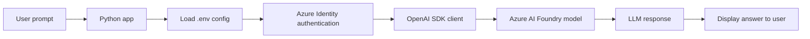
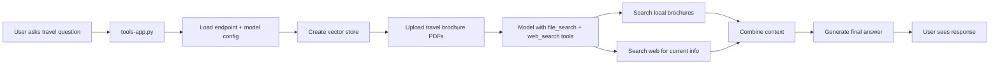

# Travel App with Microsoft Foundry

This repository is a Microsoft Learn style lab project for building generative AI applications in Azure AI Foundry. It demonstrates how to connect a Python app to a model deployed in a Microsoft Foundry project, create chat experiences, and add tools like document search and web search to handle real-world travel assistant scenarios.

## What this project is

This is not a full commercial travel booking application. It is a demo/training project designed to teach how to:

- Create and configure a Microsoft Foundry project
- Deploy a generative AI model in Azure
- Use the OpenAI Python SDK with the Azure AI endpoint
- Build a chat app using the Chat Completions and Responses APIs
- Add AI tools such as file search and web search
- Use Azure identity and secure authentication for model access

The app uses a travel assistant scenario where a user asks questions about travel services using brochure documents and general destination info.

## Technologies and tools used

- Python 3.13+
- Microsoft Azure AI Foundry
- Azure OpenAI / Azure OpenAI endpoint
- OpenAI Python SDK
- Azure Identity (`DefaultAzureCredential`, `get_bearer_token_provider`)
- Python `dotenv` for environment variable management
- VS Code for editing and running the app
- Azure CLI (`az login`) for authentication
- GitHub repository as lab source and documentation
- File-based knowledge retrieval using vector store + file search
- Web search tool for general travel advice

## Project structure

- `Instructions/Exercises/` – step-by-step lab instructions and exercises
- `labfiles/foundry-chat/python/chat-app/` – basic chat app sample built with the OpenAI SDK
- `labfiles/tools/python/tools-app/` – travel assistant app with tools enabled
- `labfiles/tools/python/tools-app/brochures/` – travel PDFs used as knowledge source
- `text-files/sample-text.txt` – example text file used in the course exercises
- `generate_lab_catalog.py` – script for generating the lab catalog metadata
- `index.md` and `readme.md` – repository landing and documentation pages

## Main apps in this repo

### 1. Chat app

Location:
`labfiles/foundry-chat/python/chat-app/chat-app.py`

This app:

- loads the Azure AI endpoint and model deployment name from `.env`
- authenticates using Azure identity
- creates an `OpenAI` client
- sends a prompt to the model
- prints the returned answer

It demonstrates the basic usage of:

- `responses.create()`
- `chat.completions.create()`
- conversation tracking with `previous_response_id`
- streaming responses

### 2. Tool-enabled travel assistant

Location:
`labfiles/tools/python/tools-app/tools-app.py`

This app is more advanced. It:

- creates a vector store in Azure AI Foundry
- uploads PDF brochures
- enables `file_search` so the model can read brochure content
- enables `web_search` so the model can search for current destination information
- answers questions like a travel assistant for Margie's Travel

This is the closest example to a real travel assistant application in the repo.

## Flow of the project

### Basic chat flow



### Tool-based travel assistant flow



### Simple ASCII diagram

```text
+-------------------+        +------------------------+
| User             | -----> | Python AI App          |
+-------------------+        | - load config          |
                              | - authenticate        |
                              | - call model          |
                              +-----------+------------+
                                          |
                                          v
                              +------------------------+
                              | Azure AI Foundry       |
                              | / Azure OpenAI model   |
                              +-----------+------------+
                                          |
                                          v
                              +------------------------+
                              | Response / Answer      |
                              +------------------------+
                                          |
                                          v
                                  User sees result
```

## How the app works

1. The user enters a question or prompt.
2. The Python app reads configuration from `.env`.
3. Azure authentication is performed with `DefaultAzureCredential`.
4. The app sends the request to the Azure AI model using the OpenAI SDK.
5. In the tool-enabled version, the model can search local brochure files and the web.
6. The model uses those sources to create a helpful answer.
7. The final response is printed in the terminal.

## Why this project matters

This project is a practical introduction to building generative AI applications on Azure. It helps developers learn:

- how AI models are deployed and consumed
- how to secure credentials and endpoints
- how to build chat experiences using modern SDKs
- how to bring external knowledge into model responses
- how to design AI assistants with tool use

## Recommended setup

1. Open the project in VS Code.
2. Create a Python virtual environment.
3. Install requirements:

```bash
pip install -r requirements.txt
```

4. Update the `.env` file with your Azure OpenAI endpoint and deployment name.
5. Sign in with Azure:

```bash
az login
```

6. Run the app:

```bash
python chat-app.py
```

or for the tool app:

```bash
python tools-app.py
```

## Summary

This repository is a Microsoft learning project that demonstrates how to build AI-powered chat and travel assistant experiences using Azure AI Foundry, Azure OpenAI, the OpenAI SDK, and tool-enabled LLM workflows.

It is best understood as an educational AI application repo rather than a complete production travel booking system.

## Repository note

The code in this repo is intentionally structured as a lab exercise. Many sections include placeholder comments where learners are expected to complete the implementation. The project is meant to teach the underlying pattern of generative AI application development in Azure rather than provide a finished end-user production product.

---

This README was updated to explain the actual purpose of the project, the technologies used, and the application flow.
